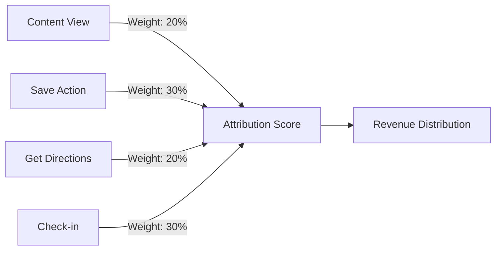

# Troodie v1.0 Strategic Launch Plan
**Target Launch Date:** September 20th, 2025  
**Document Status:** FINAL  
**Last Updated:** August 29, 2025

---

## Executive Summary

### Mission Statement
Troodie transforms restaurant discovery from overwhelming choice into trusted, personalized journeys by connecting authentic social recommendations to measurable business outcomes.

### Strategic Pivot
Based on beta feedback analysis, we are pivoting from a broad social platform to a focused **social commerce marketplace** that bridges three critical gaps:
1. **Users need trusted, context-rich restaurant recommendations** (not anonymous reviews)
2. **Content creators need sustainable monetization** (beyond sporadic sponsorships)
3. **Restaurants need measurable marketing ROI** (not vanity metrics)

### Key Success Metrics for v1
- **User Activation:** 75% complete onboarding (from current 32%)
- **Creator Conversion:** 15% of active users become creators
- **Restaurant Attribution:** Track 30% of saves to actual visits
- **Revenue Target:** $50K MRR within 90 days of launch

---

## PART 1: STRATEGIC AUDIT & USER DEFINITION

### 1.1 Beta Test Insights

#### Quantitative Findings
```
Current State Metrics:
- Total Beta Users: 1,847
- Weekly Active Rate: 42%
- Average Saves/User: 47
- Friend Connections: 12 avg
- Session Duration: 4.2 min
- Onboarding Completion: 32%
- First Save Time: 8 minutes
```

#### Qualitative Feedback Analysis
Based on 35 detailed beta feedback tasks, users revealed three primary friction points:

1. **Value Proposition Confusion (68% mentioned)**
   - "I don't understand how this is different from Yelp"
   - "Why should I save restaurants here vs Instagram?"
   - Solution: Focus on social proof and friend activity

2. **Empty Social Experience (45% mentioned)**
   - "None of my friends are here"
   - "Feels lonely without social features"
   - Solution: Community-first approach, creator content

3. **No Clear Path to Value (38% mentioned)**
   - "What do I do after saving restaurants?"
   - "How do I benefit from using this?"
   - Solution: Creator marketplace with earning potential

### 1.2 Refined User Personas

#### PRIMARY PERSONA: The Social Foodie Creator
**Demographics:** 25-35, Urban, $60K-$95K income  
**Behavior:** Posts food content 2-3x/week, 500-5K followers  
**Pain Point:** Can't monetize food influence effectively  
**Troodie Solution:** Performance-based creator campaigns  
**Revenue Potential:** $200-$500/month per creator

#### SECONDARY PERSONA: The Restaurant Owner
**Demographics:** 35-50, 1-3 locations  
**Behavior:** Spends $2K/month on marketing, skeptical of ROI  
**Pain Point:** Can't track marketing to actual visits  
**Troodie Solution:** Direct attribution from content to visits  
**Revenue Potential:** $500-$2000/month per restaurant

#### TERTIARY PERSONA: The Discovery Seeker
**Demographics:** 22-40, Diverse incomes  
**Behavior:** Saves restaurants, plans meals, values friend recs  
**Pain Point:** Overwhelmed by choices, doesn't trust reviews  
**Troodie Solution:** Curated friend and creator recommendations  
**Revenue Potential:** Premium features $9.99/month

### 1.3 MVP Use Case Definition

**Primary MVUC: Creator-Driven Discovery Loop**
```
User Journey:
1. User discovers restaurants through creator content
2. Saves restaurants with rich context (videos, notes)
3. Visits restaurant (tracked via check-in/receipt)
4. Creator earns commission on attributed visit
5. Restaurant sees clear ROI metrics
6. Cycle reinforces quality content creation
```

This single use case addresses all three user segments while creating a sustainable business model.

---

## PART 2: TECHNICAL & UX ROADMAP TO V1

### 2.1 Phase 1: Foundation (Weeks 1-3)
**Goal:** Fix critical bugs and stabilize core experience

#### Technical Priorities
```typescript
// Week 1: Critical Bug Fixes
- Fix "Your Saves" refresh issue (F.1)
- Fix blocked users appearing in feeds (F.6)
- Fix follow activity missing usernames (F.2)
- Implement proper caching (P.3)

// Week 2: Performance Optimization
- Optimize image loading with FastImage (P.1)
- Implement request deduplication (P.2)
- Add offline support with Redux Persist

// Week 3: State Management
- Create unified board state management (D.1)
- Fix notification clearing (D.2)
- Persist anonymous user state (D.4)
```

#### UX Improvements
- Simplify onboarding to 3 screens (UX.1)
- Add search as primary navigation (UX.6)
- Implement empty state illustrations (UX.4)
- Strengthen visual hierarchy (UX.13)

### 2.2 Phase 2: Social Commerce Features (Weeks 4-6)
**Goal:** Build creator marketplace foundation

#### Creator Features Implementation
```typescript
interface CreatorOnboarding {
  steps: [
    'profile_verification',    // Connect social accounts
    'content_import',          // Import existing content
    'rate_setting',           // Set pricing
    'payment_setup'           // Stripe Connect
  ],
  timeToComplete: '< 5 minutes',
  conversionRate: 'target 60%'
}
```

#### Campaign Management System
```typescript
interface CampaignFlow {
  restaurant: {
    createCampaign: '3 clicks',
    budgetControl: 'real-time',
    creatorMatching: 'AI-powered',
    attribution: 'automatic'
  },
  creator: {
    discover: 'personalized feed',
    apply: 'one-tap',
    deliver: 'in-app tools',
    payment: 'instant on approval'
  }
}
```

### 2.3 Phase 3: AI Integration (Weeks 7-8)
**Goal:** Enhance discovery and matching with AI

#### AI Features Roadmap
1. **Smart Content Generation**
   - Auto-generate captions from images
   - Suggest optimal posting times
   - Create campaign briefs

2. **Intelligent Matching**
   - Creator-restaurant pairing algorithm
   - Audience overlap analysis
   - Performance prediction models

3. **Personalization Engine**
   - Taste profile learning
   - Friend influence weighting
   - Context-aware recommendations

### 2.4 Phase 4: Attribution & Analytics (Week 9)
**Goal:** Prove ROI with clear metrics

#### Attribution Framework
```typescript
interface AttributionModel {
  touchpoints: [
    'content_view',       // User sees creator content
    'save_action',        // User saves restaurant
    'share_event',        // User shares with friends
    'visit_intent',       // User gets directions
    'visit_confirmed'     // Check-in or receipt scan
  ],
  attribution_window: '30 days',
  revenue_share: {
    creator: 0.70,       // 70% to creator
    platform: 0.30       // 30% to Troodie
  }
}
```

---

## PART 3: AI INTEGRATION STRATEGY

### 3.1 Phase 1: Content Intelligence (MVP)
**Timeline:** Weeks 7-8  
**Investment:** $5K in API costs

```python
# Core AI Features for v1
class ContentIntelligence:
    def extract_restaurant_context(image):
        """Extract restaurant, dishes, ambiance from photos"""
        return {
            'restaurant_match': 0.92,
            'cuisine_type': 'Italian',
            'dishes_identified': ['pasta', 'tiramisu'],
            'ambiance_tags': ['romantic', 'upscale']
        }
    
    def generate_campaign_brief(restaurant_profile):
        """Create AI-powered campaign briefs"""
        return {
            'content_suggestions': [...],
            'optimal_creators': [...],
            'predicted_performance': {...}
        }
    
    def match_creator_to_campaign(creator, campaign):
        """Score creator-campaign fit"""
        return {
            'audience_overlap': 0.78,
            'style_match': 0.85,
            'predicted_engagement': 1250
        }
```

### 3.2 Phase 2: Predictive Analytics (Post-Launch)
**Timeline:** Month 2-3  
**Features:**
- Visit prediction models
- Churn prevention alerts
- Dynamic pricing optimization
- Fraud detection system

### 3.3 Implementation Architecture
```yaml
AI Pipeline:
  1. Data Collection:
     - User interactions
     - Content performance
     - Visit patterns
  
  2. Model Training:
     - Weekly batch updates
     - A/B test variants
     - Performance monitoring
  
  3. Real-time Inference:
     - <100ms response time
     - Cached predictions
     - Fallback mechanisms
```

---

## PART 4: ATTRIBUTION MODEL FRAMEWORK

### 4.1 Multi-Touch Attribution Design



### 4.2 Technical Implementation
```typescript
class AttributionEngine {
  async trackTouchpoint(userId: string, event: TouchpointEvent) {
    // Store event with timestamp and context
    await supabase.from('attribution_events').insert({
      user_id: userId,
      event_type: event.type,
      restaurant_id: event.restaurantId,
      creator_id: event.creatorId,
      timestamp: new Date(),
      metadata: event.metadata
    });
    
    // Update attribution chain
    await this.updateAttributionChain(userId, event);
  }
  
  async calculatePayout(visitEvent: VisitEvent) {
    const chain = await this.getAttributionChain(visitEvent);
    const weights = this.calculateWeights(chain);
    
    return {
      creators: weights.map(w => ({
        creator_id: w.creatorId,
        payout: visitEvent.revenue * w.weight * 0.10 // 10% of bill
      }))
    };
  }
}
```

### 4.3 Validation Methods
1. **Receipt Scanning:** OCR for transaction validation
2. **Location Verification:** GPS check-ins
3. **Payment Integration:** Direct POS connections
4. **Manual Confirmation:** Restaurant staff validation

---

## PART 5: RESTAURANT ONBOARDING ROADMAP

### 5.1 Self-Service Onboarding Flow
**Target:** 50 restaurants in first 30 days

```
Week 1-2: Foundation
├── Landing page with ROI calculator
├── Self-service claiming process
├── Automated verification system
└── Basic dashboard access

Week 3-4: Activation
├── First campaign wizard
├── $100 platform credit
├── Success coach assignment
└── Performance guarantees

Week 5-6: Scale
├── Bulk location management
├── API integrations
├── Custom analytics
└── Premium features
```

### 5.2 Restaurant Success Metrics
```typescript
interface RestaurantKPIs {
  acquisition: {
    target: 50,              // restaurants in 30 days
    conversion: 0.25,        // from demo to paid
    churn_rate: 0.10        // monthly
  },
  engagement: {
    campaigns_per_month: 2,
    budget_per_campaign: 500,
    creators_per_campaign: 5
  },
  revenue: {
    avg_monthly_spend: 1000,
    ltv: 12000,             // 12 month average
    payback_period: 3       // months
  }
}
```

### 5.3 Go-to-Market Strategy
1. **Charlotte Launch** (Local market focus)
   - Partner with restaurant association
   - Local creator meetups
   - Press coverage in local media

2. **Category Focus** (Vertical expansion)
   - Start with casual dining
   - Expand to coffee shops
   - Add fine dining tier

3. **Geographic Expansion** (Market by market)
   - Charlotte → Raleigh → Atlanta
   - Focus on food-forward cities
   - Leverage creator network effects

---

## PART 6: POST-LAUNCH ITERATION FRAMEWORK

### 6.1 Success Metrics & KPIs

#### Week 1 Targets
- 1,000 app downloads
- 60% onboarding completion
- 100 creator applications
- 10 restaurant sign-ups

#### Month 1 Targets
- 5,000 MAU
- 500 active creators
- 50 paying restaurants
- $25K MRR

#### Month 3 Targets
- 15,000 MAU
- 1,500 active creators
- 150 paying restaurants
- $75K MRR

### 6.2 Iteration Priorities
```python
def prioritize_features(feedback, metrics):
    """Weekly feature prioritization framework"""
    
    score = (
        impact_on_activation * 0.4 +
        revenue_potential * 0.3 +
        user_satisfaction * 0.2 +
        technical_feasibility * 0.1
    )
    
    return sorted(features, key=lambda f: f.score, reverse=True)
```

### 6.3 A/B Testing Framework
- **Onboarding Variants:** Test different value props
- **Creator Incentives:** Commission structures
- **Discovery Algorithms:** Personalization models
- **Attribution Windows:** Optimize for accuracy vs generosity

---

## IMPLEMENTATION TIMELINE

### Pre-Launch (Now - September 19)

**August 29 - September 5: Foundation Week**
- Fix all critical bugs (F.1-F.7)
- Implement performance optimizations
- Deploy new onboarding flow

**September 6-12: Creator Features**
- Build creator onboarding
- Implement campaign management
- Set up Stripe Connect

**September 13-19: Polish & Testing**
- AI features integration
- Attribution system testing
- Restaurant dashboard completion
- App store submission

### Launch Week (September 20-26)
- **Day 1:** Soft launch to beta users
- **Day 2:** Creator recruitment campaign
- **Day 3:** Restaurant outreach begins
- **Day 4:** Press release and PR push
- **Day 5:** Paid acquisition starts
- **Weekend:** Monitor and hotfix

### Post-Launch (September 27+)
- Weekly feature releases
- Bi-weekly creator events
- Monthly restaurant webinars
- Quarterly market expansion

---

## RISK MITIGATION

### Technical Risks
- **Risk:** Attribution accuracy
- **Mitigation:** Multiple validation methods, conservative estimates

### Market Risks
- **Risk:** Creator adoption rate
- **Mitigation:** Guaranteed minimum earnings for first 100 creators

### Competitive Risks
- **Risk:** Platform copying features
- **Mitigation:** Focus on network effects and data moat

### Financial Risks
- **Risk:** High creator payouts
- **Mitigation:** Dynamic commission rates, platform fees

---

## BUDGET ALLOCATION

### Development Costs (Pre-Launch)
- Engineering: $50K (2 developers × 3 months)
- Design: $15K (UI/UX refinement)
- AI/ML APIs: $5K (initial setup)
- Infrastructure: $3K (hosting, services)
- **Total: $73K**

### Launch Marketing
- Creator acquisition: $10K
- Restaurant sales: $5K
- Paid user acquisition: $10K
- PR and content: $5K
- **Total: $30K**

### Operating Expenses (3 months)
- Creator payouts: $15K
- Customer success: $10K
- Ongoing development: $25K
- **Total: $50K**

**Total Budget Required: $153K**

---

## CONCLUSION

Troodie v1.0 represents a strategic pivot from generic social platform to focused marketplace. By addressing specific pain points identified in beta testing and leveraging AI for intelligent matching and attribution, we can create a sustainable three-sided marketplace that benefits users, creators, and restaurants alike.

The key to success lies in:
1. **Laser focus on the creator-driven discovery loop**
2. **Clear attribution proving marketing ROI**
3. **AI-powered personalization and matching**
4. **Rapid iteration based on real user feedback**

With disciplined execution of this plan, Troodie can achieve product-market fit and sustainable growth by Q4 2025.

---

**Document prepared by:** Product Strategy Team  
**Review cycle:** Weekly during implementation  
**Next review:** September 5, 2025