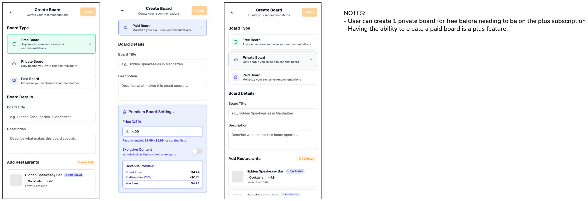

## Add/Create Flow Implementation

---

## **1. Add Screen (Hub) Implementation**

### **Purpose & Goals**

- Central hub for all content creation actions
- Clear categorization of different creation types
- Quick access to frequently used features
- Progress tracking and gamification


### **Layout Structure**

#### **Header Section**

- **Title**: "Add Content"
- **Subtitle**: "What would you like to add?"
- **Minimal design** for content focus


#### **Primary Actions Grid**

```typescript
interface AddOption {
  id: string
  title: string
  description: string
  icon: LucideIcon
  color: string // Background color
  navigateTo: Screen
  badge?: string // "New", "Popular", etc.
}

const addOptions = [
  {
    id: "restaurant",
    title: "Save a Restaurant",
    description: "Add a new spot to your collection",
    icon: Restaurant,
    color: "bg-[#FFAD27]",
    navigateTo: "save-restaurant"
  },
  {
    id: "board",
    title: "Create a Board",
    description: "Curate a themed collection",
    icon: FolderPlus,
    color: "bg-blue-500",
    navigateTo: "create-board"
  },
  {
    id: "community",
    title: "Join Communities",
    description: "Connect with like-minded Troodies",
    icon: Users,
    color: "bg-purple-500",
    navigateTo: "communities"
  },
  {
    id: "creator",
    title: "Creator Dashboard",
    description: "Manage collaborations & earnings",
    icon: Crown,
    color: "bg-green-500",
    navigateTo: "creator-dashboard"
  }
]
```

#### **Quick Actions Section**

- **Search Places** - Direct restaurant search
- **Find Friends** - Social network building
- **Compact grid layout** (2 columns)


#### **Progress Gamification**

```typescript
interface ProgressCard {
  title: string
  description: string
  progress: {
    current: number
    target: number
    unit: string // "places", "friends", etc.
  }
  reward: string
  cta: string
}
```

---

## **2. Save Restaurant Flow Implementation**

### **Purpose & Goals**

- Quick restaurant addition to personal collection
- Rich metadata capture (photos, notes, ratings)
- Social sharing and board organization
- Location-based discovery


### **Flow Steps**

#### **Step 1: Restaurant Search/Discovery**

```typescript
interface RestaurantSearch {
  searchMethods: [
    "text_search",    // Name or cuisine search
    "location_based", // GPS or map selection
    "photo_upload",   // Image recognition
    "manual_entry"    // Full manual input
  ]
  searchResults: RestaurantSearchResult[]
}

interface RestaurantSearchResult {
  id: string
  name: string
  address: string
  cuisine: string[]
  rating?: number
  photos: string[]
  verified: boolean
  distance?: number
  priceRange?: string
}
```

#### **Step 2: Restaurant Details Capture**

```typescript
interface RestaurantSaveForm {
  restaurant: RestaurantSearchResult
  userInput: {
    personalRating: number // 1-5 stars
    visitDate: Date
    photos: File[] // User-uploaded photos
    notes: string // Personal experience notes
    tags: string[] // "Date night", "Quick lunch", etc.
    wouldRecommend: boolean
    priceRange: "$" | "$$" | "$$$" | "$$$$"
    visitType: "dine_in" | "takeout" | "delivery"
  }
  privacy: "public" | "friends" | "private"
}
```

#### **Step 3: Board Assignment**

```typescript
interface BoardSelection {
  existingBoards: Board[]
  selectedBoards: string[] // Board IDs
  createNewBoard?: {
    name: string
    description: string
    privacy: "public" | "private"
  }
}
```

#### **Step 4: Social Sharing**

```typescript
interface SocialSharing {
  shareToFeed: boolean
  caption: string
  tagFriends: User[]
  shareToStories: boolean
  crossPlatformShare: {
    instagram: boolean
    twitter: boolean
  }
}
```

### **UI Components**

#### **Photo Upload Component**

- **Camera integration** for live capture
- **Gallery selection** for existing photos
- **Photo editing** (crop, filter, brightness)
- **Multiple photo support** (up to 10)


#### **Rating Component**

- **5-star rating system**
- **Quick rating buttons** (thumbs up/down)
- **Comparison rating** ("Better than X")


#### **Tag Suggestion System**

```typescript
interface TagSuggestion {
  category: "occasion" | "mood" | "food_type" | "experience"
  suggestions: string[]
  userTags: string[] // Previously used tags
}
```

---

## **3. Create Board Flow Implementation**

### **Purpose & Goals**

- Organized restaurant collections
- Monetization through paid boards
- Social curation and sharing
- Themed content creation


### **Flow Steps**

#### **Step 1: Board Type Selection**

```typescript
interface BoardType {
  type: "free" | "private" | "paid"
  features: {
    visibility: "public" | "private" | "paid_access"
    collaboration: boolean
    monetization: boolean
    analytics: boolean
  }
  pricing?: {
    price: number
    currency: "USD"
    billingType: "one_time" | "subscription"
  }
}

const boardTypes = [
  {
    type: "free",
    title: "Free Board",
    description: "Anyone can view and save your recommendations",
    icon: Globe,
    features: ["Public visibility", "Social sharing", "Basic analytics"]
  },
  {
    type: "private",
    title: "Private Board",
    description: "Only people you invite can see this board",
    icon: Lock,
    features: ["Invite-only access", "Collaboration", "Privacy controls"]
  },
  {
    type: "paid",
    title: "Paid Board",
    description: "Monetize your exclusive recommendations",
    icon: Crown,
    features: ["Premium content", "Revenue sharing", "Advanced analytics"]
  }
]
```

#### **Step 2: Board Information**

```typescript
interface BoardCreationForm {
  basicInfo: {
    title: string
    description: string
    coverImage?: File
    category: string // "Date Night", "Quick Lunch", "Hidden Gems"
    location?: string // Geographic focus
  }
  settings: {
    allowComments: boolean
    allowSaves: boolean
    collaborators?: User[]
    tags: string[]
  }
  monetization?: {
    price: number
    exclusiveContent: boolean
    memberBenefits: string[]
  }
}
```

#### **Step 3: Restaurant Selection**

```typescript
interface RestaurantSelection {
  availableRestaurants: Restaurant[] // User's saved restaurants
  selectedRestaurants: Restaurant[]
  searchAndAdd: boolean // Allow adding new restaurants
  minimumRequired: number // Minimum restaurants for board
  orderingEnabled: boolean // Allow custom ordering
}
```

#### **Step 4: Monetization Setup (Paid Boards)**

```typescript
interface MonetizationSetup {
  pricing: {
    basePrice: number
    currency: "USD"
    discounts?: {
      earlyBird: number
      bulk: number
    }
  }
  content: {
    exclusivePhotos: boolean
    insiderTips: boolean
    personalRecommendations: boolean
    directContact: boolean
  }
  revenue: {
    platformFee: number // 15%
    estimatedEarnings: number
    payoutSchedule: "weekly" | "monthly"
  }
}
```

### **Board Preview System**

```typescript
interface BoardPreview {
  layout: "grid" | "list" | "map"
  restaurantCards: {
    showRating: boolean
    showPrice: boolean
    showNotes: boolean
    showPhotos: boolean
  }
  socialProof: {
    creatorInfo: boolean
    memberCount: boolean
    recentActivity: boolean
  }
}
```

---

## **4. Join Communities Flow Implementation**

### **Purpose & Goals**

- Social network building
- Event-based community discovery
- Location-based connections
- Premium community access


### **Flow Steps**

#### **Step 1: Community Discovery**

```typescript
interface CommunityDiscovery {
  discoveryMethods: [
    "trending",      // Popular communities
    "location",      // Nearby communities
    "interests",     // Based on user preferences
    "friends",       // Friend recommendations
    "events",        // Event-based communities
    "search"         // Direct search
  ]
  filters: {
    location: string
    category: string[] // "Food", "Events", "Professional"
    memberCount: "small" | "medium" | "large"
    activity: "high" | "medium" | "low"
    type: "free" | "paid" | "private"
  }
}
```

#### **Step 2: Community Information Display**

```typescript
interface CommunityDetail {
  basicInfo: {
    name: string
    description: string
    coverImage: string
    category: string
    location: string
    memberCount: number
    activityLevel: number
  }
  admin: {
    name: string
    avatar: string
    verified: boolean
    bio: string
  }
  stats: {
    postsToday: number
    activeMembers: number
    recentPhotos: string[]
  }
  access: {
    type: "public" | "private" | "paid"
    price?: number
    requirements?: string[]
    approvalNeeded: boolean
  }
  preview: {
    recentPosts: CommunityPost[]
    memberHighlights: User[]
    upcomingEvents?: Event[]
  }
}
```

#### **Step 3: Join Process**

```typescript
interface JoinProcess {
  joinType: "instant" | "request" | "payment"
  requirements?: {
    application: {
      questions: string[]
      responses: string[]
    }
    verification: {
      email: boolean
      phone: boolean
      identity: boolean
    }
  }
  payment?: {
    amount: number
    currency: "USD"
    billingCycle: "one_time" | "monthly" | "yearly"
    benefits: string[]
  }
}
```

#### **Step 4: Onboarding (Post-Join)**

```typescript
interface CommunityOnboarding {
  welcome: {
    message: string
    rules: string[]
    guidelines: string[]
  }
  introduction: {
    promptToIntroduce: boolean
    introductionTemplate: string
    suggestedTopics: string[]
  }
  recommendations: {
    membersToFollow: User[]
    postsToCheck: CommunityPost[]
    eventsToJoin: Event[]
  }
}
```

---

## **5. Creator Dashboard Flow Implementation**

### **Purpose & Goals**

- Creator monetization management
- Campaign tracking and analytics
- Collaboration opportunity discovery
- Revenue optimization


### **Dashboard Sections**

#### **Overview Tab**

```typescript
interface CreatorOverview {
  stats: {
    totalEarnings: number
    thisMonthEarnings: number
    activeCampaigns: number
    completedCampaigns: number
    averageRating: number
    responseRate: number
    followers: number
    engagementRate: number
  }
  quickActions: [
    "view_opportunities",
    "create_portfolio",
    "update_rates",
    "message_restaurants"
  ]
  recentActivity: CreatorActivity[]
  upcomingDeadlines: Campaign[]
}
```

#### **Campaigns Tab**

```typescript
interface CampaignManagement {
  activeCampaigns: Campaign[]
  campaignApplications: CampaignApplication[]
  completedCampaigns: Campaign[]
  campaignTemplates: CampaignTemplate[]
}

interface Campaign {
  id: string
  restaurant: Restaurant
  title: string
  description: string
  requirements: string[]
  budget: number
  deadline: Date
  status: "pending" | "active" | "review" | "completed" | "cancelled"
  progress: number
  deliverables: Deliverable[]
  messages: Message[]
}
```

#### **Opportunities Tab**

```typescript
interface OpportunityDiscovery {
  availableOpportunities: Opportunity[]
  filters: {
    budget: [number, number] // Min, max
    cuisine: string[]
    location: string
    timeline: string
    campaignType: string[]
  }
  recommendations: Opportunity[] // AI-powered matches
  savedOpportunities: Opportunity[]
}

interface Opportunity {
  id: string
  restaurant: Restaurant
  title: string
  description: string
  budget: number
  timeline: string
  requirements: string[]
  applicantCount: number
  postedDate: Date
  tags: string[]
  matchScore?: number // AI compatibility score
}
```

#### **Earnings Tab**

```typescript
interface EarningsManagement {
  summary: {
    totalEarnings: number
    pendingPayments: number
    thisMonthEarnings: number
    projectedEarnings: number
  }
  transactions: Transaction[]
  payoutSettings: {
    method: "bank" | "paypal" | "stripe"
    schedule: "weekly" | "monthly"
    minimumPayout: number
  }
  taxDocuments: TaxDocument[]
}
```

### **Creator Profile Setup**

```typescript
interface CreatorProfile {
  portfolio: {
    photos: File[]
    videos: File[]
    previousWork: WorkSample[]
    testimonials: Testimonial[]
  }
  rates: {
    postRate: number
    storyRate: number
    videoRate: number
    packageDeals: PackageDeal[]
  }
  preferences: {
    cuisineTypes: string[]
    locationRadius: number
    minimumBudget: number
    availableDays: string[]
    responseTime: string
  }
  verification: {
    socialMediaAccounts: SocialAccount[]
    followerCount: number
    engagementRate: number
    verified: boolean
  }
}
```

---

## **6. Cross-Flow Interactions**

### **Data Sharing Between Flows**

```typescript
interface SharedData {
  restaurants: Restaurant[] // Available across save and board flows
  userPreferences: UserPreferences // Influences all recommendations
  socialGraph: SocialGraph // Used in community and creator flows
  locationData: LocationData // GPS for restaurant and community discovery
}
```

### **Navigation Patterns**

```typescript
// Flow transitions
Add Hub → Save Restaurant → Board Assignment → Social Share
Add Hub → Create Board → Restaurant Selection → Monetization Setup
Add Hub → Communities → Community Detail → Join Process → Onboarding
Add Hub → Creator Dashboard → Opportunities → Campaign Application → Campaign Management
```

### **State Management**

```typescript
interface FlowState {
  currentFlow: "save" | "board" | "community" | "creator"
  currentStep: number
  totalSteps: number
  formData: any
  canGoBack: boolean
  canSkipStep: boolean
  validationErrors: ValidationError[]
}
```

---

## **7. Success Metrics & Analytics**

### **Flow Completion Rates**

- **Save Restaurant**: Target 85% completion
- **Create Board**: Target 70% completion (higher complexity)
- **Join Community**: Target 90% completion
- **Creator Setup**: Target 60% completion (extensive process)


### **User Engagement Metrics**

- **Time to complete** each flow
- **Drop-off points** identification
- **Feature usage** within each flow
- **User satisfaction** scores post-completion


### **Business Metrics**

- **Paid board creation** rate
- **Premium community** join rate
- **Creator monetization** adoption
- **Revenue per user** from paid features

---

## 8. Visual Reference

The following images illustrate the add/create flow and related features:

### Add Content Hub


*Central hub for adding content. Shows options for saving a restaurant, creating a board, joining communities. ("Creator Dashboard" is currently hidden in the product.)*

### Create Board Flow


*Step-by-step board creation, including free, private, and paid board types, premium settings, and board details. Notes: Users can create 1 private board for free; paid boards require a plus subscription.*

### Communities Flow


*Community discovery, joining, and premium community features. Includes featured and joined communities, community details, and top contributors.*

> Place the referenced images in the `prd/add-flow` directory. Update these as the UI evolves to keep this section current.